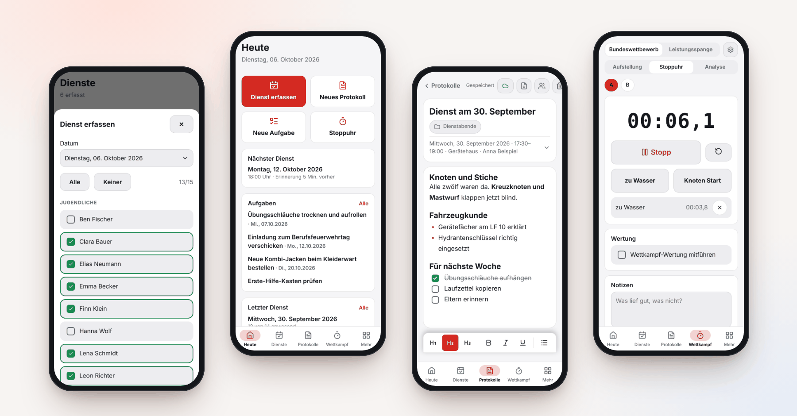
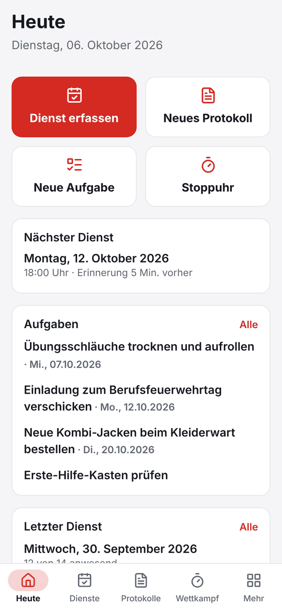
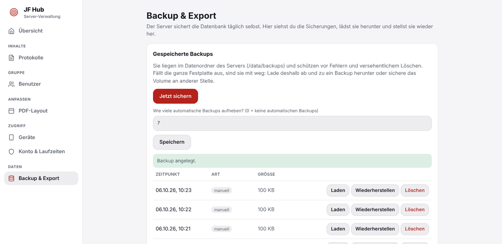

<div align="center">


# JF Hub

**Die selbst gehostete Zentrale für Jugendfeuerwehr-Betreuer.**<br>
Protokolle, Dienste, Aufgaben, Kleidergrößen und Wettkampf-Training – auf Handy, Tablet und Laptop, auch ohne Netz.

[](LICENSE)
[](https://github.com/Volltext/JF-Hub/actions/workflows/ci.yml)
[](https://github.com/Volltext/JF-Hub/releases)


[**Demo ausprobieren**](https://volltext.github.io/JF-Hub/demo/) ·
[**Loslegen**](#-in-5-minuten-loslegen) ·
[Funktionen](#-was-kann-jf-hub) ·
[Screenshots](#-so-sieht-es-aus) ·
[Anleitungen](#-anleitungen) ·
[Datenschutz](docs/datenschutz.md)

<br>



</div>

<br>

> [!NOTE]
> Inoffizielles Projekt aus der Jugendfeuerwehr-Praxis, kein Produkt der Deutschen Jugendfeuerwehr. Regeln und Wertungen sind eine Hilfe ohne Gewähr (siehe [NOTICE](NOTICE.md)).

## ✨ Was kann JF Hub?

| | Bereich | Das gibt es |
| :---: | --- | --- |
| 📝 | **Protokolle** | Editor mit Überschriften, Listen und Checklisten, **Fotos**, Anhänge und **Handschrift**, Ordner, Volltextsuche, **PDF** im eigenen Layout (Logo, Fußzeile, Farbe) |
| 📅 | **Dienste** | Anwesenheit per Antippen erfassen, Statistik, wöchentliche **Erinnerung** (mit Ferien-Rhythmus je Bundesland) |
| ✅ | **Aufgaben** | Eigene Aufgaben oder für alle Betreuer **veröffentlichen**, mit Fälligkeit und Erinnerung |
| 👕 | **Kleidung** | Kleidergrößen je Mitglied, „eine Größe größer“ vormerken, fertige PDF-Liste für den Kleiderwart |
| ⏱️ | **Wettkampf** | Bundeswettbewerb und Leistungsspange: Aufstellung, Stoppuhr, Fehlerwertung, Analyse, Wissensdatenbank |
| 👥 | **Mehrere Betreuer** | Eigenes Konto je Person (Einladung per Link), Protokolle und Aufgaben **privat oder für alle** |
| 📱 | **Überall nutzbar** | Als **App im Browser** (iPhone, Android, Windows, Mac, Linux) oder als **Android-App** mit Stift-Handschrift |
| 📴 | **Offline** | Alles liegt lokal auf dem Gerät und wird abgeglichen, sobald wieder Netz da ist |
| 🔒 | **Deine Daten** | Alles liegt auf **deinem** Server, nicht bei einem Anbieter. Keine Werbung, keine Analyse |

## 📸 So sieht es aus

<table>
  <tr>
    <td align="center" width="33%"><br><b>Heute</b><br><sub>Alles Wichtige auf einen Blick</sub></td>
    <td align="center" width="33%"><br><b>Dienst erfassen</b><br><sub>Anwesende antippen, speichern</sub></td>
    <td align="center" width="33%"><br><b>Protokolle</b><br><sub>Schreiben, teilen, als PDF</sub></td>
  </tr>
  <tr>
    <td align="center"><br><b>Aufgaben</b><br><sub>Privat oder für alle Betreuer</sub></td>
    <td align="center"><br><b>Kleidung</b><br><sub>Größen und Bestellliste</sub></td>
    <td align="center"><br><b>Wettkampf</b><br><sub>Stoppuhr mit Zwischenzeiten</sub></td>
  </tr>
</table>

<details>
<summary><b>Die Verwaltung für den Admin (am Rechner)</b></summary>
<br>


<br><br>


</details>

## 🚀 In 5 Minuten loslegen

Du brauchst nur einen Rechner, auf dem [Docker](https://docs.docker.com/get-docker/) läuft (Compose v2.24 oder neuer) – ein Raspberry Pi, ein NAS, ein Heimserver oder ein kleiner Cloud-Server reichen.

**1. Starten**

```bash
git clone https://github.com/Volltext/JF-Hub.git
cd JF-Hub
docker compose up -d
```

**2. Setup-Code ablesen**

```bash
docker compose logs jf-hub | grep -A2 Ersteinrichtung
```

**3. Admin-Konto anlegen**

Öffne **http://localhost:8080/admin/**, gib den Setup-Code ein und lege dein Konto an. Danach lädst du unter **Benutzer** die anderen Betreuer ein: Jeder bekommt einen Link und vergibt sein Passwort selbst.

Die App für alle Betreuer liegt unter **http://localhost:8080/**. Das war's. 🎉

> [!TIP]
> Kein `git`? Es geht auch mit einer einzigen Datei oder einem einzigen Befehl: [Installationsanleitung](docs/installation.md). Wie es danach weitergeht: [Erste Schritte](docs/erste-schritte.md).

## 🌍 Von unterwegs erreichbar machen

Damit Betreuer auch außerhalb des Heimnetzes zugreifen können – und damit **App-Installation und Benachrichtigungen** funktionieren – braucht der Server eine verschlüsselte Adresse (https). Der einfachste Weg ist ein **Cloudflare Tunnel**: kostenlos, ohne Port-Freigabe am Router, ohne Zertifikate.

```bash
# TUNNEL_TOKEN in .env eintragen (Schritt für Schritt: docs/cloudflare-tunnel.md), dann:
docker compose --profile tunnel up -d
```

Du hast schon einen Reverse-Proxy, eine eigene Domain oder Tailscale? Dann schau in die [HTTPS-Alternativen](docs/https-alternativen.md) (Caddy mit automatischem Zertifikat ist eine Zeile).

## 📲 Als App installieren

| Weg | So geht's | Gut für |
| --- | --- | --- |
| **App im Browser (PWA)** – empfohlen | Adresse öffnen, anmelden, dann „Zum Startbildschirm hinzufügen“ bzw. „App installieren“. Auf iPhone/iPad ist das für Benachrichtigungen Pflicht. | Alle Geräte, immer aktuell |
| **Android-App** (optional) | APK aus den [Releases](https://github.com/Volltext/JF-Hub/releases) laden und installieren. | Handschrift mit Stiftdruck und Texterkennung, zuverlässige Erinnerungen. [Details](docs/android-app.md) |

## 📚 Anleitungen

| Ich möchte … | Dann lies |
| --- | --- |
| JF Hub zum ersten Mal einrichten und benutzen | [Erste Schritte](docs/erste-schritte.md) |
| Auf meinem Server installieren (Docker, NAS, Portainer …) | [Installation](docs/installation.md) |
| Von außen per https erreichbar sein | [Cloudflare Tunnel](docs/cloudflare-tunnel.md) · [Alternativen](docs/https-alternativen.md) |
| Betreuer einladen und verstehen, wer was sieht | [Benutzer und Sichtbarkeit](docs/benutzer-und-sichtbarkeit.md) |
| Die Android-App nutzen oder selbst bauen | [Android-App](docs/android-app.md) |
| Die Demo verstehen oder einen eigenen Demo-Server betreiben | [Demo](docs/demo.md) |
| Wissen, welche Daten gespeichert werden | [Datenschutz](docs/datenschutz.md) |
| Von der alten Version 1.x umsteigen | [Umstieg von 1.x](docs/umstieg-von-1x.md) |
| Am Code mitarbeiten | [Entwicklung](docs/entwicklung.md) · [CONTRIBUTING](CONTRIBUTING.md) |

Eine Übersicht aller Seiten steht auch in [docs/](docs/README.md).

## 🔧 Das Wichtigste zum Betrieb

<details>
<summary><b>Einstellungen (<code>.env</code>)</b></summary>
<br>

Alles ist optional, die Standardwerte funktionieren. Die Werte stehen in einer `.env` neben der `docker-compose.yml` (Vorlage: [.env.example](.env.example)).

| Variable | Bedeutung | Standard |
| --- | --- | --- |
| `BIND`, `HOST_PORT` | Adresse und Port, auf denen der Server im Netz lauscht (`0.0.0.0` = ganzes Heimnetz) | `127.0.0.1`, `8080` |
| `DATA_PATH` | Ordner oder Volume für die Datenbank | Volume `jf-hub-data` |
| `ADMIN_USER`, `ADMIN_PASSWORD` | Admin-Konto beim ersten Start anlegen (statt Setup-Code) | leer |
| `PUSH_SUBJECT` | Kontaktadresse für den Push-Dienst (`mailto:…`) – bitte eigene eintragen | `mailto:admin@example.com` |
| `TRUST_PROXY` | Welchen Proxys `X-Forwarded-For` geglaubt wird | private Netze |
| `TUNNEL_TOKEN` | Token für Cloudflare Tunnel (Profil `tunnel`) | leer |
| `DEMO`, `DEMO_RESET_AT` | Öffentliche [Demo](docs/demo.md) mit Beispieldaten, täglich zurückgesetzt. **Löscht alle Daten!** | `0`, `03:00` |
| `TZ` | Zeitzone | `Europe/Berlin` |

</details>

<details>
<summary><b>Aktualisieren</b></summary>
<br>

```bash
docker compose pull && docker compose up -d     # neue Version (fertiges Image von GitHub)
docker compose up -d --build                    # neue Version (aus den Quellen gebaut)
```

Die Datenbank wird beim Start automatisch auf den neuen Stand gebracht. Was sich ändert, steht im [CHANGELOG](CHANGELOG.md).

</details>

<details>
<summary><b>Sichern und Wiederherstellen</b></summary>
<br>

Die Datenbank ist **eine Datei** (`jf-hub.sqlite` im Volume `/data`). Der Server sichert täglich selbst in `/data/backups`. In der Admin-Oberfläche unter **Backup & Export** lädst du Backups herunter und stellst sie mit einem Klick wieder her. Für Ausfallsicherheit sicherst du zusätzlich das Volume an anderer Stelle. Mehr dazu in der [Installationsanleitung](docs/installation.md#backup-und-wiederherstellung).

</details>

<details>
<summary><b>Sicherheit und Datenschutz</b></summary>
<br>

- Passwörter werden mit scrypt gespeichert, Anmeldungen sind einzeln widerrufbar, Login-Versuche sind begrenzt, der Container läuft ohne Root-Rechte.
- JF Hub speichert bewusst wenig: Namen der Mitglieder, Anwesenheit, Kleidergrößen – **keine** Geburtsdaten, Adressen oder Kontaktdaten.
- Es sind Daten von Kindern und Jugendlichen. Lies bitte [Datenschutz](docs/datenschutz.md) und klär das Hosting mit deiner Wehr bzw. deinem Träger.
- Sicherheitslücken bitte vertraulich melden: [SECURITY.md](SECURITY.md).

</details>

## 🧑‍💻 Mitmachen

Fehler gefunden oder eine Idee? Ein [Issue](https://github.com/Volltext/JF-Hub/issues/new/choose) hilft schon. Wer am Code mitarbeiten möchte, startet so:

```bash
cd server && npm install && npm run dev        # Server auf :8080
cd app    && npm install && npm run dev:web    # Web-App mit Hot-Reload auf :5173
```

Aufbau, Architektur und Regeln stehen in [Entwicklung](docs/entwicklung.md) und [CONTRIBUTING.md](CONTRIBUTING.md).

```
app/      React + TypeScript (Vite), PWA und Android (Capacitor, Java-Teile für Handschrift)
server/   Node 22, Fastify, SQLite, PDF-Erzeugung, Admin-Oberfläche
docs/     Anleitungen
e2e/      Rauchtest im Browser (Playwright)
```

## 📄 Lizenz und Herkunft

JF Hub steht unter der **GNU Affero General Public License v3.0** ([LICENSE](LICENSE)). Wer eine geänderte Version als Dienst anbietet, muss den Quelltext seiner Änderungen weitergeben.
Der Wettkampf-Teil geht auf [open-JF-Coach](NOTICE.md) zurück. Quellen, Marken und Hinweise stehen in [NOTICE.md](NOTICE.md).

<div align="center">
<br>
<sub>Gemacht von Ehrenamtlichen für Ehrenamtliche. 🚒</sub>
</div>
