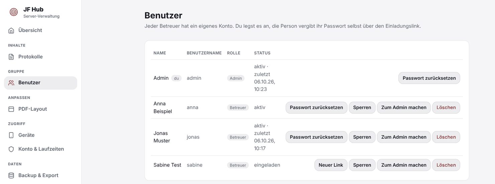
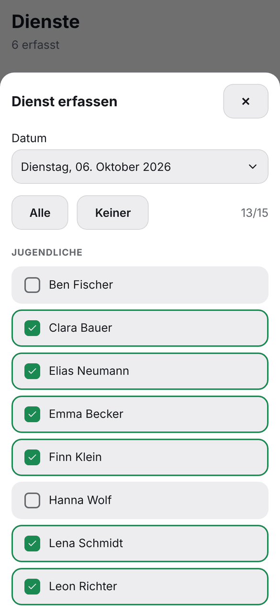
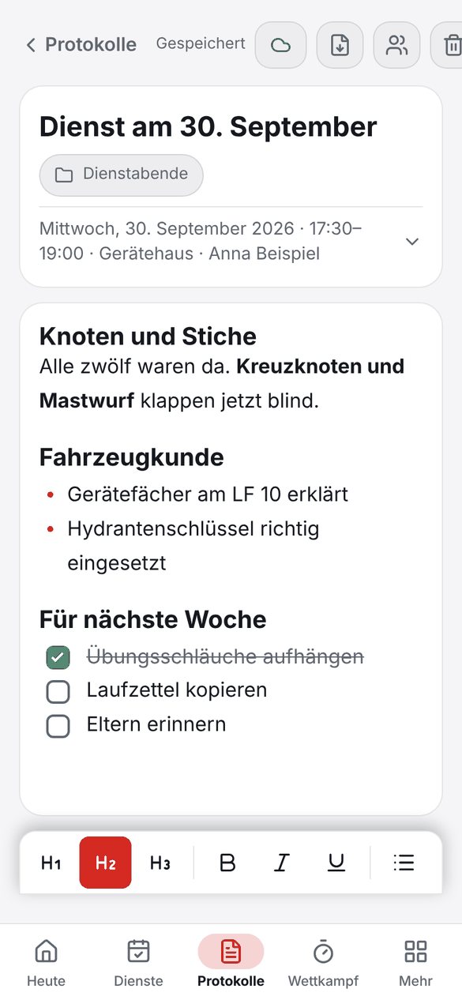
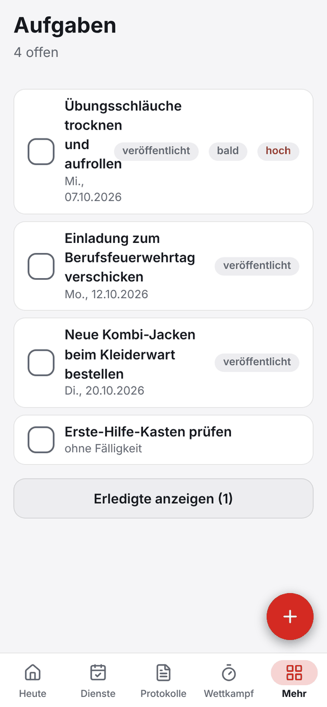
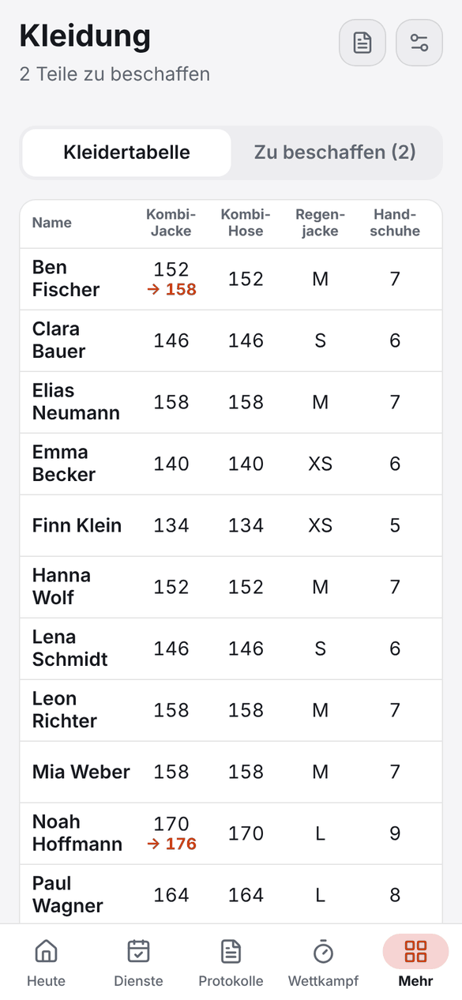
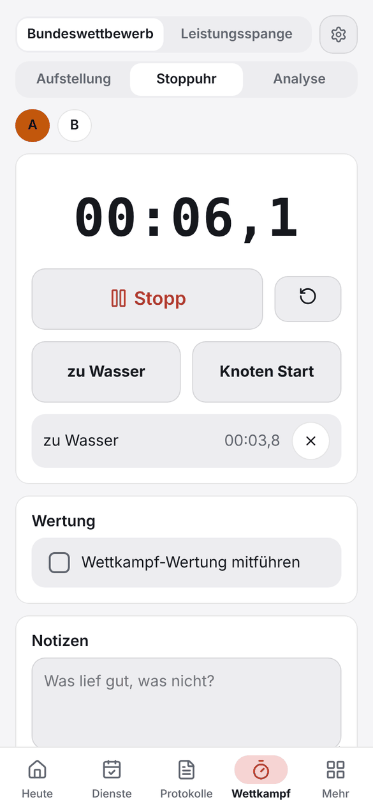

# Erste Schritte

[← Dokumentation](README.md)

Du hast JF Hub [installiert](installation.md) und willst loslegen? In zehn Minuten ist die Gruppe eingerichtet und alle Betreuer sind dabei.

**Auf dieser Seite**

1. [Admin-Konto anlegen](#1-admin-konto-anlegen)
2. [Betreuer einladen](#2-betreuer-einladen)
3. [App aufs Handy bringen](#3-app-aufs-handy-bringen)
4. [Gruppe anlegen](#4-gruppe-anlegen)
5. [Den ersten Dienst erfassen](#5-den-ersten-dienst-erfassen)
6. [Protokoll schreiben](#6-protokoll-schreiben)
7. [Aufgaben, Kleidung und Wettkampf](#7-aufgaben-kleidung-und-wettkampf)
8. [Erinnerungen einschalten](#8-erinnerungen-einschalten)

> [!NOTE]
> **Zwei Adressen, zwei Aufgaben:** Unter `/admin/` verwaltet der **Admin** den Server (Benutzer, Backup, PDF-Layout). Unter `/` arbeiten **alle Betreuer** mit der App. Zum Ausprobieren ist das `http://localhost:8080/admin/` und `http://localhost:8080/`.

---

## 1. Admin-Konto anlegen

1. Setup-Code im Log ablesen:
   ```bash
   docker compose logs jf-hub | grep -A2 Ersteinrichtung
   ```
2. **`/admin/`** öffnen, den Code eingeben und Benutzername und Passwort für dich wählen (mindestens 10 Zeichen).

Der Code funktioniert nur, solange es noch kein Konto gibt. Danach kann niemand mehr auf diesem Weg einen Admin anlegen.

**Optional:** Unter **Admin → PDF-Layout** trägst du den Namen deiner Gruppe, ein Logo, eine Fußzeile und die Farbe ein. Das erscheint auf allen PDFs.

## 2. Betreuer einladen

1. **Admin → Benutzer**
2. Benutzername und Anzeigename eintragen (z. B. `anna` und `Anna Beispiel`)
3. **Betreuer einladen** drücken
4. Den **Einladungslink** kopieren und per Messenger verschicken



Der Link gilt 7 Tage und lässt sich einmal benutzen. Die Person vergibt ihr **eigenes Passwort**. Du als Admin kennst nie ein Passwort.

Mehr dazu, auch zu Rollen und „Passwort vergessen“: [Benutzer und Sichtbarkeit](benutzer-und-sichtbarkeit.md).

## 3. App aufs Handy bringen

Jeder Betreuer öffnet die Adresse des Servers im Browser, meldet sich an und installiert JF Hub wie eine App:

| Gerät | So geht's |
| --- | --- |
| **iPhone / iPad** | In Safari auf **Teilen** tippen, dann **Zum Home-Bildschirm** |
| **Android** | In Chrome auf **⋮** tippen, dann **App installieren** (oder **Zum Startbildschirm hinzufügen**) |
| **Windows / Mac / Linux** | In Chrome oder Edge auf das **Installieren-Symbol** in der Adressleiste klicken |

> [!IMPORTANT]
> Installieren und Benachrichtigungen gehen **nur über eine https-Adresse**. Wie du die bekommst, steht in [Cloudflare Tunnel](cloudflare-tunnel.md) (empfohlen) und den [HTTPS-Alternativen](https-alternativen.md).

Wer Stift-Handschrift braucht, nimmt zusätzlich die [Android-App](android-app.md).

## 4. Gruppe anlegen

In der App unter **Mehr → Mitglieder** auf das **+** tippen und alle Jugendlichen und Betreuer mit Namen eintragen. Mehr braucht JF Hub bewusst nicht: keine Geburtsdaten, keine Adressen.

Die Mitglieder sind für **alle Betreuer** sichtbar und werden bei Dienst, Kleidung und Wettkampf wiederverwendet.

## 5. Den ersten Dienst erfassen

<table>
<tr>
<td valign="top">

1. Auf **Heute** den roten Knopf **Dienst erfassen** drücken (oder unter **Dienste** auf **+**)
2. Datum prüfen
3. Die Anwesenden **antippen**. **Alle** und **Keiner** helfen bei großen Gruppen
4. **Speichern**

Unter **Dienste** siehst du alle bisherigen Abende. Bei **Mitglieder** steht pro Person, an wie vielen Diensten sie teilgenommen hat (in Prozent).

</td>
<td width="36%">

</td>
</tr>
</table>

## 6. Protokoll schreiben

<table>
<tr>
<td valign="top">

1. Unter **Protokolle** auf **+** tippen
2. **Titel** vergeben, optional einen **Ordner** wählen
3. Losschreiben. Die Leiste unten bietet Überschriften, **fett**, *kursiv*, Hervorheben, **Links**, Listen und Checklisten. Unter **＋** findest du **Tabellen**, Zitate, Trennlinien und Handschrift. Steht der Cursor in einer Tabelle oder in einem Link, erscheint eine Leiste mit den passenden Handgriffen (Zeile hinzufügen, Link öffnen …)
4. Fotos (werden automatisch verkleinert) und Dateien bis 10 MB hängst du als Anhang an. Sie laden beim nächsten Abgleich hoch, auch wenn du sie ohne Netz einfügst. Auf Android gibt es zusätzlich **Handschrift** mit Stift
5. Gespeichert wird **automatisch**. Oben steht „Gespeichert“

Das Symbol mit den zwei Personen macht das Protokoll **für alle Betreuer sichtbar**. Das Download-Symbol erzeugt ein **PDF** im Layout deiner Gruppe. Die Suche oben in der Liste durchsucht alle Protokolle im Volltext. Versehentlich gelöscht? Im **Papierkorb** (Symbol oben in der Liste) holst du es 30 Tage lang zurück.

Tabellen, Links und Hervorhebung gibt es ab Version 2.3.0. Ältere Apps zeigen solche Protokolle nur zum Lesen: Dann einfach die App aktualisieren.

</td>
<td width="36%">

</td>
</tr>
</table>

> [!TIP]
> Neue Protokolle sind **zuerst privat**. Erst wenn du sie veröffentlichst, sehen sie die anderen. Wer lieber gleich für alle schreibt, stellt das unter **Einstellungen → Darstellung & neue Einträge** um.

## 7. Aufgaben, Kleidung und Wettkampf

<table>
<tr>
<td align="center" width="33%"></td>
<td align="center" width="33%"></td>
<td align="center" width="33%"></td>
</tr>
<tr>
<td valign="top">

**Aufgaben**

**+** tippen, Titel, Fälligkeit und Priorität wählen. Mit **Für alle Betreuer veröffentlichen** erledigt die Gruppe sie gemeinsam. Abhaken genügt, die App zeigt, wer sie erledigt hat.

</td>
<td valign="top">

**Kleidung**

Pro Mitglied trägst du die aktuelle Größe ein. Mit **eine Größe größer** merkst du Bestellwünsche vor. Der Tab **Zu beschaffen** erzeugt die fertige **PDF-Liste für den Kleiderwart**.

</td>
<td valign="top">

**Wettkampf**

Wähle Bundeswettbewerb oder Leistungsspange, stelle die **Aufstellung** zusammen und nimm Läufe mit der **Stoppuhr** samt Zwischenzeiten und Fehlerwertung auf. Die **Analyse** zeigt den Verlauf deiner Läufe und eine Matrix, wer auf welcher Position schon eingesetzt war.

</td>
</tr>
</table>

## 8. Erinnerungen einschalten

Unter **Einstellungen → Erinnerungen** legst du fest, wann der wöchentliche Dienst ist (Wochentag, Uhrzeit, Ferien-Rhythmus je Bundesland) und wie früh die Erinnerung kommen soll.

In der installierten Browser-App schaltest du dort auch **Benachrichtigungen** ein und prüfst sie mit **Testbenachrichtigung senden**. In der Android-App sind es lokale Alarme, die auch ohne Server klappen.

---

## Wie geht's weiter?

- **Mehr Betreuer, Rollen, privat oder veröffentlicht:** [Benutzer und Sichtbarkeit](benutzer-und-sichtbarkeit.md)
- **Daten sichern:** [Backup und Wiederherstellung](installation.md#backup-und-wiederherstellung)
- **Datenschutz mit der Wehr klären:** [Datenschutz](datenschutz.md)
- **Etwas klemmt?** Frag in einem [Issue](https://github.com/Volltext/JF-Hub/issues/new/choose) nach.
